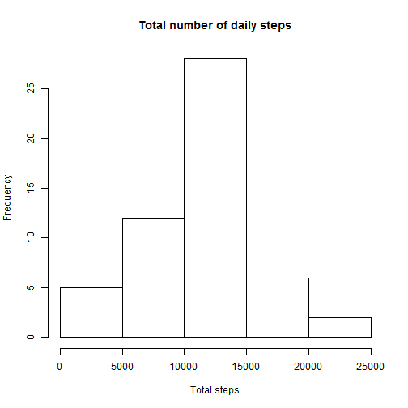
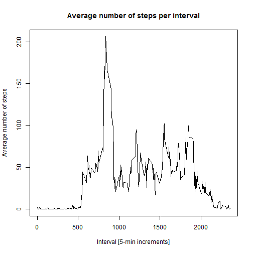
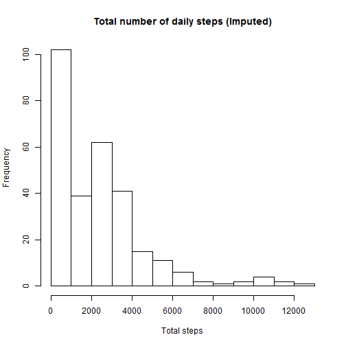
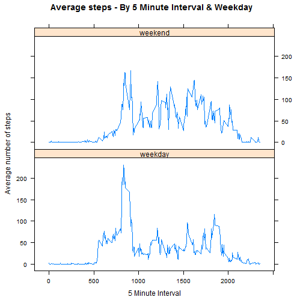

Activity Monitoring Analysis
=============================

### Install Packages & Set working directory

```r
setwd("~/Rajasekar Alamanda/KC/R/Coursera - Data Science/Reproducible Research")

library(dplyr)
library(plyr)
library(lattice)
```
        
### Read file & format date field

```r
Activity <- read.csv("Activity.csv",stringsAsFactors = FALSE)

str(Activity)
```

```
## 'data.frame':	17568 obs. of  3 variables:
##  $ steps   : int  NA NA NA NA NA NA NA NA NA NA ...
##  $ date    : chr  "2012-10-01" "2012-10-01" "2012-10-01" "2012-10-01" ...
##  $ interval: int  0 5 10 15 20 25 30 35 40 45 ...
```

```r
Activity$date <- as.Date(Activity$date)
str(Activity)
```

```
## 'data.frame':	17568 obs. of  3 variables:
##  $ steps   : int  NA NA NA NA NA NA NA NA NA NA ...
##  $ date    : Date, format: "2012-10-01" "2012-10-01" ...
##  $ interval: int  0 5 10 15 20 25 30 35 40 45 ...
```

### Total steps taken per day
#### Histogram of "Total steps per day"

```r
DailySteps <- aggregate(steps~date,Activity,sum)
hist(DailySteps$steps,xlab="Total steps",main="Total number of daily steps")
```



#### Mean and Median daily steps

```r
DailySteps_Mean <- mean(DailySteps$steps, na.rm=TRUE)
DailySteps_Median <- median(DailySteps$steps, na.rm=TRUE)
```

### Average daily steps by 5 minute interval

```r
Minute <- aggregate(steps~interval,Activity,mean)
names(Minute)[names(Minute) == 'steps'] <- 'Mean_Steps'

plot(Minute,type="l",xlab="Interval [5-min increments]",ylab="Average number of steps",main="Average number of steps per interval")
```



### Impute missing values

```r
Activity_Imputed = merge(Activity, Minute, by="interval")
Activity_Imputed$steps[is.na(Activity_Imputed$steps)] = Activity_Imputed$Mean_Steps[is.na(Activity_Imputed$steps)]

Grouped_Activity <- aggregate(steps~interval,Activity_Imputed,sum)
hist(Grouped_Activity$steps,xlab="Total steps",main="Total number of daily steps (Imputed)")
```



```r
DailySteps_Mean_Imputed <- mean(Grouped_Activity$steps, na.rm=TRUE)
DailySteps_Median_Imputed <- median(Grouped_Activity$steps, na.rm=TRUE)
```

### Indicator for Weekend and Weekday

```r
Weekend_Ind <- function(date) {
        if (weekdays(date) %in% c("Saturday", "Sunday")) {
                "weekend"
        } else {
                "weekday"
        }
}
```

### Plot by weekend and weekday

```r
Activity_Imputed$DayCat <- as.factor(sapply(Activity_Imputed$date, Weekend_Ind))
str(Activity_Imputed)
```

```
## 'data.frame':	17568 obs. of  5 variables:
##  $ interval  : int  0 0 0 0 0 0 0 0 0 0 ...
##  $ steps     : num  1.72 0 0 0 0 ...
##  $ date      : Date, format: "2012-10-01" "2012-11-23" ...
##  $ Mean_Steps: num  1.72 1.72 1.72 1.72 1.72 ...
##  $ DayCat    : Factor w/ 2 levels "weekday","weekend": 1 1 2 1 2 1 2 1 1 2 ...
```

```r
ImputedMinuteDayCat <- ddply(Activity_Imputed,.(interval,DayCat),summarize,Mean_Steps=mean(steps))


xyplot(Mean_Steps~interval|DayCat,data=ImputedMinuteDayCat,type="l",layout = c(1,2),
       main="Average steps (imputed) per interval and type of day",
       ylab="Average number of steps",xlab="Interval [5-min increments]")
```




